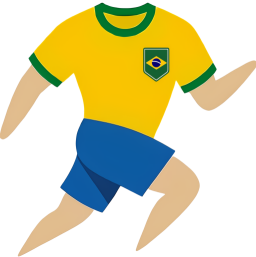

# Mundo das Camisas

Este é um projeto front-end de uma loja virtual fictícia de camisetas esportivas, desenvolvido por alunos do curso de Análise e Desenvolvimento de Sistemas da **UNISUAM**.

O foco do projeto é aplicar conceitos de Front-End, construindo uma interface responsiva e acessível por meio de manipulação do DOM e LocalStorage.

🌐 **[Acesse o Site (Netlify)](http://mundodascamisas.netlify.app)**  
📄 **[Leia a Documentação do Projeto (Overleaf)](https://www.overleaf.com/read/tkdmsjskwdgq#f81772)**

---

## Objetivo

Temos como objetivo entregar aos usuários um serviço acessível, responsivo e versátil, demonstrando competência para competir com outros serviços em meio à alta do assunto futebol. Além disso, o projeto visa solidificar o aprendizado na criação de interfaces web modernas, focando no essencial apesar de não rejeitar a ideia de usar uma framework como o Bootstrap onde se vê mais utilidade.

## Funcionalidades

O projeto atende a diversos requisitos técnicos e de negócio, incluindo:

- **Autenticação Simulada:** Cadastro e Login de usuários armazenados no navegador usando `localStorage`.
- **Controle de Sessão:** Proteção das páginas internas e exibição do nome do usuário logado na barra de navegação.
- **Validações de Cadastro:**
    - Regex para logins de 6 letras, senhas de 8 letras e nomes de 15 a 30 letras.
    - Máscara dinâmica de telefone `(+55)XX-XXXXXXXX`.
- **Acessibilidade:**
    - Alternância de tema (Alto Contraste/Modo Escuro).
    - Controle de aumento e diminuição do tamanho da fonte para usuários com baixa visão.
- **Responsividade:** Layout 100% adaptável para dispositivos móveis (Mobile-First) e Desktops.